# Mermaid.md - 시각화 다이어그램

## 1. 사용자 여정 (User Journey)

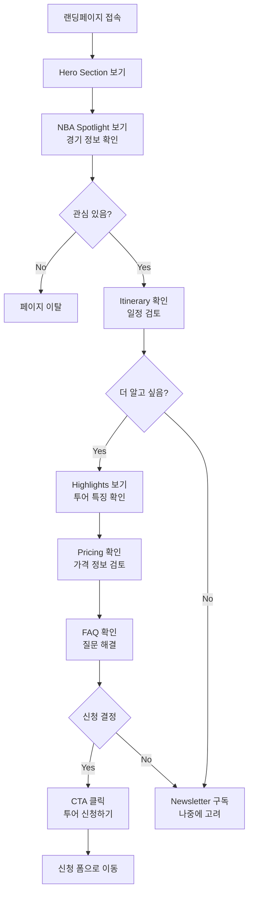

---

## 2. 페이지 구조 (Page Layout)

```mermaid
graph TD
    subgraph LAYOUT["페이지 레이아웃"]
        HEADER["Header<br/>로고, 네비게이션, 테마토글"]
        HERO["Hero Section<br/>김맘바와 함께하는 NBA 직관투어<br/>배경: NBA 경기장"]
        NBA["NBA Spotlight<br/>3경기 카드 레이아웃<br/>Warriors vs Grizzlies<br/>Lakers vs Spurs<br/>Lakers vs Mavericks"]
        ITINERARY["Itinerary Section<br/>5일 일정 확장/축약<br/>Day1~5 카드"]
        HIGHLIGHTS["Highlights Section<br/>4개 카드<br/>연예인가이드, 3경기, 전식사, 보험"]
        PRICING["Pricing Section<br/>₩6,800,000<br/>포함/불포함 항목"]
        FAQ["FAQ Section<br/>5개 Q&A<br/>Accordion"]
        CTA["CTA Section<br/>투어 신청하기 버튼"]
        NEWSLETTER["Newsletter<br/>플레이스홀더 div"]
        FOOTER["Footer<br/>연락처, 소셜링크"]
    end
    
    HEADER --> HERO
    HERO --> NBA
    NBA --> ITINERARY
    ITINERARY --> HIGHLIGHTS
    HIGHLIGHTS --> PRICING
    PRICING --> FAQ
    FAQ --> CTA
    CTA --> NEWSLETTER
    NEWSLETTER --> FOOTER
```

---

## 3. 컴포넌트 계층 (Component Hierarchy)

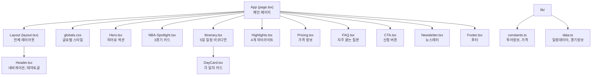

---

## 4. 데이터 흐름 (Data Flow)

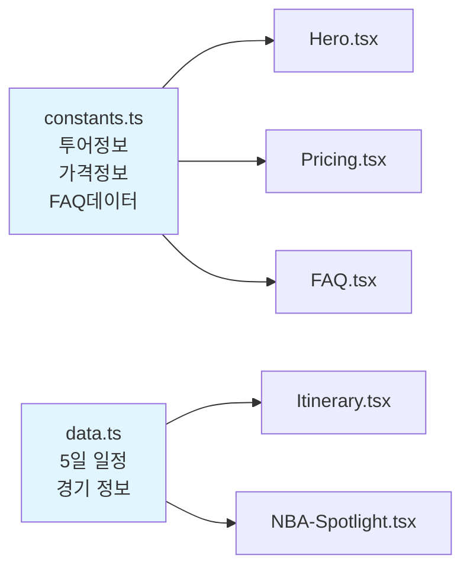

---

## 5. 반응형 디자인 브레이크포인트

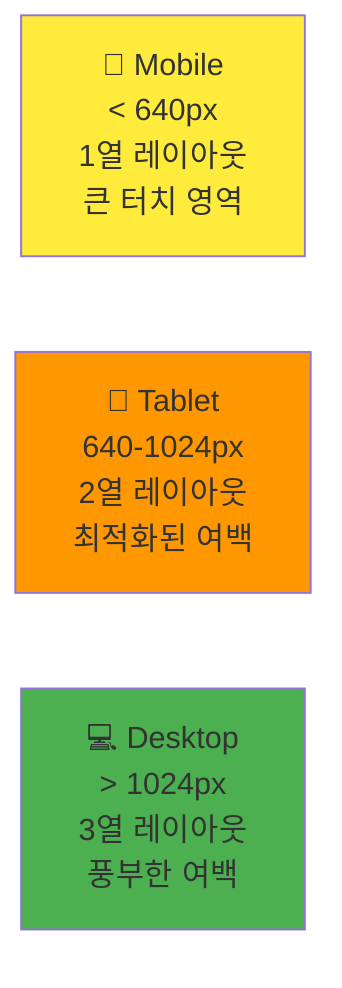

---

## 6. 다크/라이트 모드 테마

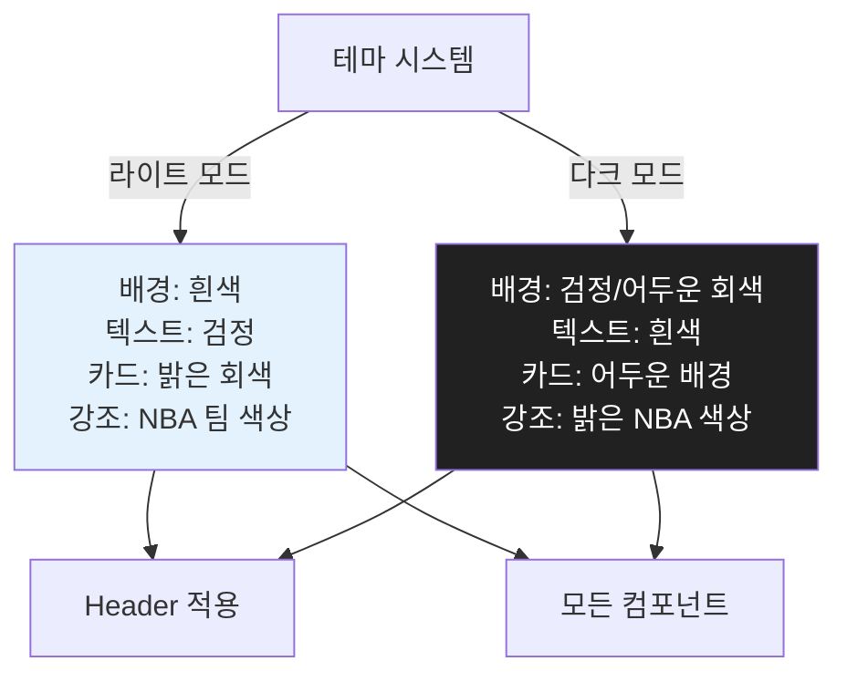

---

## 7. 개발 워크플로우 (Development Workflow)

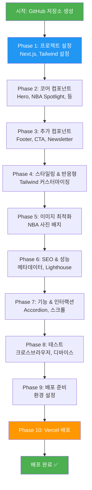

---

## 8. NBA 사진 배치 전략

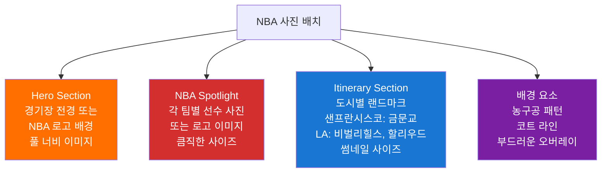

---

## 9. SEO & 메타데이터 구조

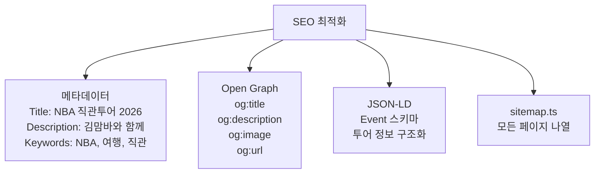

---

## 10. 배포 파이프라인 (Deployment Pipeline)

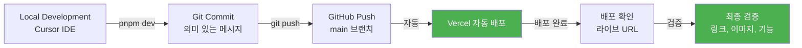

---

## 11. 컴포넌트 상태 관리

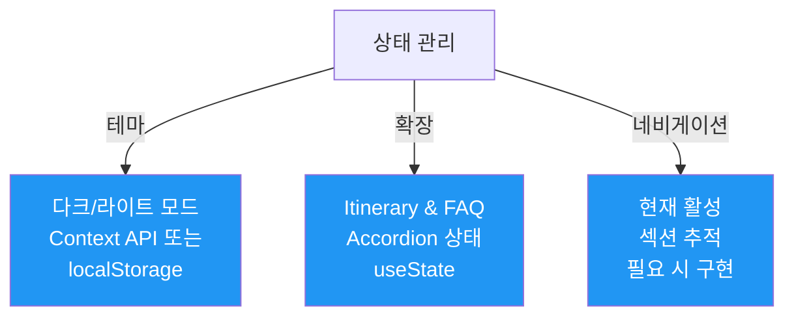

---

## 12. 성능 최적화 체크리스트

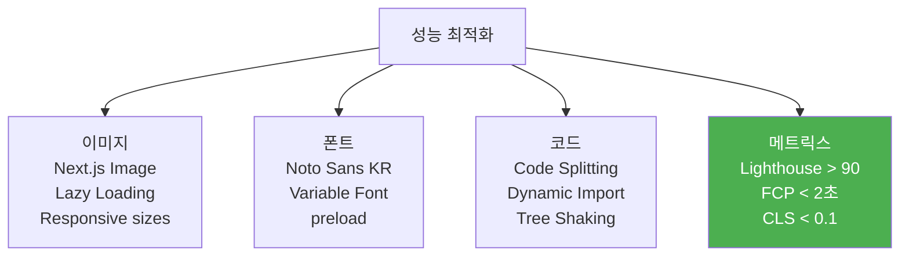